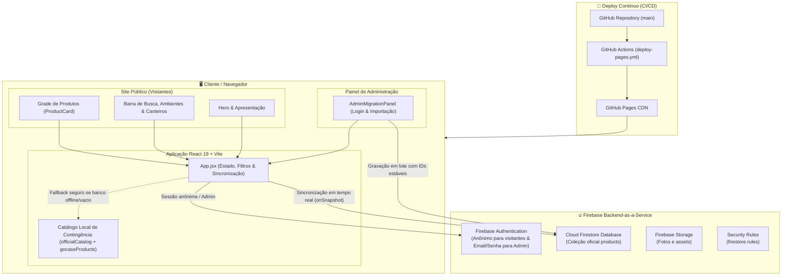
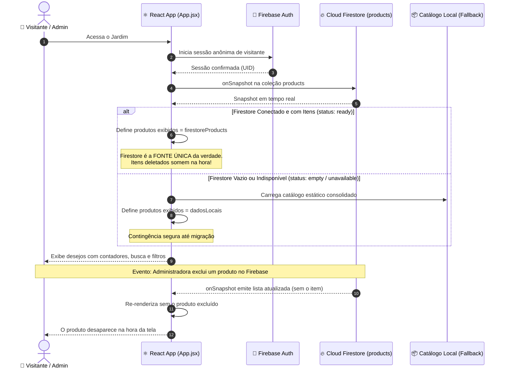

# 🌿 Jardim dos Presentes de Michèlé Joohann

> **Desejar. Cultivar. Conquistar. Florescer.** ✨  
> Um espaço digital e afetivo para transformar desejos em sementes: registrar sonhos, acompanhar o que já foi conquistado e dar significado a cada realização.

---

## 🏛️ Arquitetura do Sistema

O **Jardim dos Presentes** foi construído com arquitetura baseada em **React 19**, **Vite 7** e **Firebase 12**, entregue via **GitHub Pages** através de integração contínua (GitHub Actions).



---

## 🔄 Ciclo de Vida dos Dados e Tempo Real

A arquitetura adota o **Cloud Firestore como Fonte Única da Verdade** em tempo de execução:

1. **Leitura Reativa (`onSnapshot`)**: Assim que a página abre, um listener escuta a coleção `products` do Firestore. Qualquer alteração (criação, edição ou exclusão) reflete na tela **instantaneamente sem recarregar a página**.
2. **Exclusão Imediata (Sem Ressurreição)**: Quando um produto é excluído no Firestore, o aplicativo atualiza a lista em tempo real. O catálogo local **não** ressuscita itens removidos quando o Firestore está ativo (`ready`).
3. **Fallback Seguro**: O catálogo local consolidado em código serve de contingência estritamente quando o banco estiver indisponível ou vazio (antes da migração inicial).



---

## 🗂️ Estrutura do Projeto

```text
JardimDosDesejos/
├── .github/
│   └── workflows/
│       └── deploy-pages.yml      # CI/CD: build Vite e deploy automático no GitHub Pages
├── docs/
│   ├── ARCHITECTURE.md           # Desenho detalhado da arquitetura e fluxos
│   ├── FIREBASE_SETUP.md         # Instruções de configuração do Firebase Console
│   ├── INITIAL_MIGRATION.md      # Procedimento de migração e consolidação de dados
│   └── PRODUCT_BACKLOG.md        # Histórico de requisitos e backlog
├── public/
│   ├── favicon.svg               # Favicon do Jardim
│   └── images/                   # Imagens e referências visuais
├── src/
│   ├── components/
│   │   ├── AdminMigrationPanel.jsx # Painel administrativo (login e importação em lote)
│   │   └── ProductCard.jsx       # Card de produto com status, história, sonho e links
│   ├── data/
│   │   ├── catalog.js            # Catálogo base histórico
│   │   ├── officialCatalog.js    # Catálogo consolidado oficial (84 produtos com overrides)
│   │   └── gocaseProducts.js     # Coleção Gocase (2 produtos)
│   ├── firebase/
│   │   └── config.js             # Inicialização do SDK Firebase (Auth, Firestore, Storage)
│   ├── services/
│   │   └── productMigration.js   # Serviço de migração idempotente (lotes com writeBatch)
│   ├── styles/
│   │   └── global.css            # Estilos globais, tokens de cores e responsividade
│   ├── App.jsx                   # Componente raiz: autenticação, queries e filtros
│   └── main.jsx                  # Ponto de montagem da aplicação React 19
├── firestore.rules               # Regras de segurança atômicas do Firestore
├── index.html                    # Entrada HTML principal com metadados SEO
├── package.json                  # Manifesto do projeto e dependências
├── vite.config.js                # Configuração do Vite com base /jardim-de-desejos/
└── README.md                     # Este documento
```

---

## 🧚 Funcionalidades

- 🌱 **Catálogo Afetivo**: Organização por ambientes (categorias) e canteiros (subcategorias).
- 🔍 **Busca Completa**: Pesquisa textual instantânea por nome, coleção, história, sonho e descrição.
- 💰 **Valores & Referências**: Informações de preços, condições e lojas de origem.
- 📖 **História & Significado**: Cada presente carrega o registro do sonho e da memória associada.
- 🎁 **Presentear & Reservas em Tempo Real**: Visitantes podem marcar que *"Vão comprar"* ou *"Já compraram"* qualquer item diretamente no card.
- 💌 **Mensagens de Carinho & Modo Anônimo**: Opção de se identificar (com nome e contato) ou presentear em segredo (modo anônimo), deixando uma dedicatória afetiva para a Michèlé.
- 📬 **Gestão Privada de Presentes**: Painel administrativo sob demanda (`?admin=true`) com visualização exclusiva de todos os recados recebidos e controle de liberação de itens.
- 🔥 **Firestore em Tempo Real**: Atualizações, edições, marcações de presentes e exclusões instantâneas via `onSnapshot`.
- 🛡️ **Privacidade & Segurança Reforçada**: Regras granulares no Firestore garantindo que mensagens e dados de contato sejam lidos exclusivamente pela administradora.

---

## 📝 Como Gerenciar Produtos no Firebase

Com a arquitetura consolidada, a gestão dos produtos pode ser feita diretamente pelo **Firebase Console** (Firestore Database → Coleção `products`):

| Ação | Como fazer no Firebase Console | Comportamento no Site |
|---|---|---|
| **Excluir um produto** | Clique no documento do produto na coleção `products` e selecione **Excluir documento**. | O produto **some imediatamente** da tela em tempo real para todos os usuários. |
| **Ocultar temporariamente (Soft Delete)** | Edite o campo `published` para `false` no documento. | O produto fica guardado no banco mas não é renderizado na grade pública. |
| **Editar preço ou foto** | Atualize o campo `price`, `priceLabel` ou `imageUrl` no documento. | O card atualiza instantaneamente no site sem recarregar a página. |
| **Marcar como Realizado** | Altere o campo `status` para `"received"` ou iguale `quantityReceived` ao `quantityDesired`. | O card exibe o selo **"Floresceu 🌸"** / **"Realizado"**. |
| **Adicionar novo desejo** | Crie um novo documento na coleção `products` com um `id` descritivo (ex: `luminaria-vintage`). | O novo desejo aparece instantaneamente na grade e nos filtros. |

---

## 🛠️ Tecnologias

- **React 19** (`^19.1.0`)
- **Vite 7** (`^7.0.0`)
- **Firebase 12** (`^12.0.0`): Authentication, Cloud Firestore e Storage
- **Vanilla CSS Moderno**: Design system artesanal com gradientes, tokens de cores e micro-interações
- **GitHub Actions & GitHub Pages**: Deploy contínuo automatizado

---

## 🚀 Como Executar Localmente

### 1. Instalar dependências
```bash
npm install
```

### 2. Iniciar o servidor de desenvolvimento
```bash
npm run dev
```
O servidor local iniciará em `http://localhost:5173/jardim-de-desejos/`.

### 3. Gerar build de produção
```bash
npm run build
```

### 4. Testar a versão de produção localmente
```bash
npm run preview
```

---

## 🌸 Filosofia

O **Jardim dos Presentes** não é uma simples lista de compras. É um registro sensível de aspirações, histórias e sonhos — permitindo cultivar a gratidão e celebrar cada pequena ou grande conquista.
