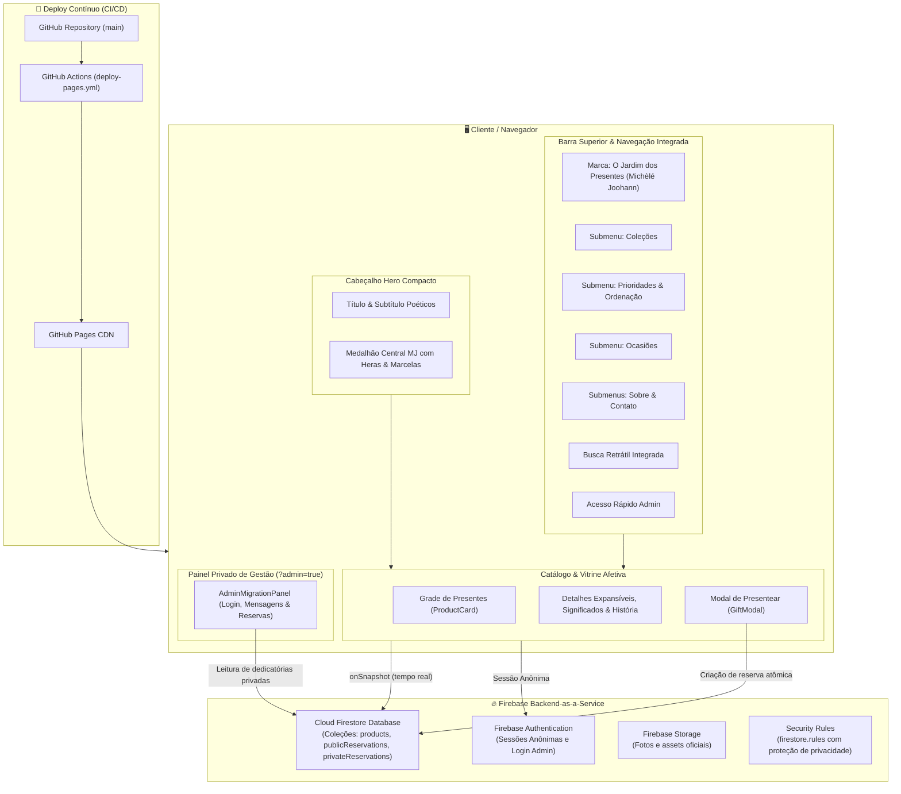
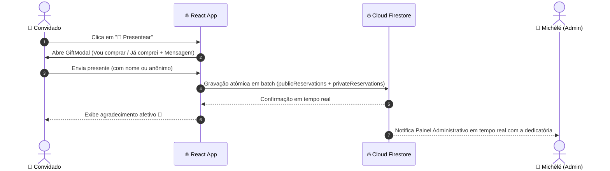

# 🌿 Jardim dos Presentes de Michèlé Joohann

> **Desejar. Cultivar. Conquistar. Florescer.** ✨  
> Um espaço digital e afetivo para transformar desejos em sementes: registrar sonhos, acompanhar o que já foi conquistado e dar significado a cada realização.
> 
> *Direção de Arte: Herbarium Botânico Vitoriano de Luxo com selo medalhão MJ, folhagens silvestres, heras e marcelas.*

---

## 🏛️ Arquitetura do Sistema

O **Jardim dos Presentes** é construído sobre uma arquitetura moderna com **React 19**, **Vite 7** e **Firebase 12**, entregue via **GitHub Pages** através de integração e deploy contínuos (GitHub Actions).


```mermaid
graph TB
    subgraph Client ["🖥️ Cliente / Navegador"]
        subgraph TopNav ["Barra Superior & Navegação Integrada"]
            Brand["Marca: O Jardim dos Presentes (Michèlé Joohann)"]
            MenuColecoes["Submenu: Coleções"]
            MenuPrioridades["Submenu: Prioridades & Ordenação"]
            MenuOcasioes["Submenu: Ocasiões"]
            MenuSobreContato["Submenus: Sobre & Contato"]
            SearchBtn["Busca Retrátil Integrada"]
            AdminBtn["Acesso Rápido Admin"]
        end

        subgraph HeroSection ["Cabeçalho Hero Compacto"]
            HeroTitle["Título & Subtítulo Poéticos"]
            Medallion["Medalhão Central MJ com Heras & Marcelas"]
        end

        subgraph PublicUI ["Catálogo & Vitrine Afetiva"]
            Grid["Grade de Presentes (ProductCard)"]
            Details["Detalhes Expansíveis, Significados & História"]
            GiftModalUI["Modal de Presentear (GiftModal)"]
        end

        subgraph AdminUI ["Painel Privado de Gestão (?admin=true)"]
            AdminPanel["AdminMigrationPanel (Login, Mensagens & Reservas)"]
        end
    end

    subgraph FirebaseServices ["🔥 Firebase Backend-as-a-Service"]
        Auth["Firebase Authentication<br/>(Sessões Anônimas e Login Admin)"]
        Firestore["Cloud Firestore Database<br/>(Coleções: products, publicReservations, privateReservations)"]
        Storage["Firebase Storage<br/>(Fotos e assets oficiais)"]
        Rules["Security Rules<br/>(firestore.rules com proteção de privacidade)"]
    end

    subgraph HostingPipeline ["🚀 Deploy Contínuo (CI/CD)"]
        GHRepo["GitHub Repository (main)"]
        GHActions["GitHub Actions (deploy-pages.yml)"]
        GHPages["GitHub Pages CDN"]
    end

    TopNav --> PublicUI
    HeroSection --> PublicUI
    PublicUI -- "onSnapshot (tempo real)" --> Firestore
    PublicUI -- "Sessão Anônima" --> Auth
    GiftModalUI -- "Criação de reserva atômica" --> Firestore
    AdminPanel -- "Leitura de dedicatórias privadas" --> Firestore

    GHRepo --> GHActions
    GHActions --> GHPages
    GHPages --> Client
```

---

## 🎨 Identidade Visual: Herbarium Botânico Vitoriano

O projeto adota uma atmosfera de **herbário clássico do século XIX**, unindo sofisticação botânica e afeto:

1. **Moldura Botânica Silvestre**: Ilustrações vetoriais laterais (`herbarium-wild-left.svg` e `herbarium-wild-right.svg`) emolduram a tela com ramos botânicos de marcela e folhagens antigas.
2. **Selo Medalhão MJ**: Emblema heráldico central no Hero gravado em tons de ouro antigo (`#c2a76b`) e verde bosque (`#19311f`), envolvido por ramagens de hera entrelaçadas.
3. **Navegação Superior Flutuante**:
   - **Coleções**: Filtro rápido por categorias (*Casa*, *Vestuário*, *Joias*, *Livros*, *Tecnologia*, *Arte*, etc.).
   - **Prioridades & Ordenação**: Filtragem por urgência afetiva (*🍃 Alta*, *🌸 Média*, *🌰 Baixa*) e ordenação instantânea (*Maior prioridade*, *Menor prioridade*, *Valor*, *Nome*).
   - **Ocasiões**: Filtragem por subcategorias e momentos.
   - **Sobre**: Apresentação sensível do propósito do Jardim.
   - **Contato**: Canal direto com a Michèlé via e-mail.
   - **Busca Retrátil**: Campo de pesquisa rápido que abre no cabeçalho sem poluir o visual.
4. **Cards Editoriais de Presente**:
   - Fotografia ou ícone botânico emoldurado.
   - Badge de status (*Disponível*, *Reservado*, *Floresceu 🌸*).
   - Seção poética *"O sonho"*.
   - Gaveta de detalhes colapsável: tags de significados, tamanho desejado, prioridade, decisão de compra, valores e histórias.
   - Ações: link oficial para a loja e botão **🎁 Presentear**.

---

## 🔄 Ciclo de Vida dos Dados e Sincronização em Tempo Real

O **Cloud Firestore** é a **Fonte Única da Verdade** da aplicação:

1. **Coleção `products`**:
   - Armazena todos os desejos cadastrados (nome, coleção, subcategoria, preço, prioridade, imagem, história, sonho, etc.).
   - O listener reativo `onSnapshot` atualiza a vitrine instantaneamente sem necessidade de recarregar o navegador.
   - Se um produto for excluído ou desativado (`visible: false`), ele desaparece na mesma hora para todos os visitantes.

2. **Coleção `publicReservations`**:
   - Guarda o status público de reserva (`reserved` ou `received`) associado a cada produto.
   - Permite que todos os visitantes vejam quais presentes já estão a caminho ou floresceram, sem expor dados pessoais do convidado.

3. **Coleção `privateReservations`**:
   - Guarda as dedicatórias, nomes, contatos e mensagens confidenciais enviadas pelos convidados.
   - Protegida por regras de segurança estritas no Firestore (`firestore.rules`), visível unicamente pela administradora autenticada.


```mermaid
sequenceDiagram
    autonumber
    actor Convidado as 🌸 Convidado
    participant App as ⚛️ React App
    participant Firestore as 🔥 Cloud Firestore
    actor Michele as 🌿 Michèlé (Admin)

    Convidado->>App: Clica em "🎁 Presentear"
    App->>Convidado: Abre GiftModal (Vou comprar / Já comprei + Mensagem)
    Convidado->>App: Envia presente (com nome ou anônimo)
    App->>Firestore: Gravação atômica em batch (publicReservations + privateReservations)
    Firestore-->>App: Confirmação em tempo real
    App-->>Convidado: Exibe agradecimento afetivo 🌸
    Firestore-->>Michele: Notifica Painel Administrativo em tempo real com a dedicatória
```

---

## 🗂️ Estrutura do Projeto

```text
JardimDosPresentes/
├── .github/
│   └── workflows/
│       └── deploy-pages.yml          # CI/CD: build Vite e deploy automático no GitHub Pages
├── docs/
│   ├── ARCHITECTURE.md               # Detalhes de arquitetura e decisões técnicas
│   ├── FIREBASE_SETUP.md             # Instruções de configuração do Firebase Console
│   ├── INITIAL_MIGRATION.md          # Histórico de consolidação e migração de dados
│   ├── PRODUCT_BACKLOG.md            # Histórico de requisitos e melhorias
│   └── STAGING_LIST.md               # Lista de produtos preparados para staging
├── public/
│   ├── favicon.svg                   # Favicon oficial do Jardim
│   └── images/                       # Ilustrações botânicas vetoriais e fotos
│       ├── herbarium-wild-left.svg   # Moldura botânica esquerda
│       ├── herbarium-wild-right.svg  # Moldura botânica direita
│       └── ...                       # Fotografias de catálogo
├── src/
│   ├── components/
│   │   ├── AdminMigrationPanel.jsx   # Painel da Michèlé (leitura de recados e liberação de itens)
│   │   ├── GiftModal.jsx             # Modal interativo de presente com dedicatória e anonimato
│   │   └── ProductCard.jsx           # Card editorial de presente (status, tags, sonho e links)
│   ├── firebase/
│   │   └── config.js                 # Inicialização do Firebase (Auth, Firestore, Storage)
│   ├── services/
│   │   ├── reservationService.js     # Serviços atômicos de reserva pública e privada
│   │   └── stagedMigration.js        # Script de carga em lote para produtos em staging
│   ├── styles/
│   │   └── global.css                # Design system completo do Herbário Vitoriano
│   ├── App.jsx                       # Aplicação principal: topo, busca, hero, filtros e grid
│   └── main.jsx                      # Ponto de montagem React 19
├── data/
│   └── stagedProductsForFirestore.json # Dados estruturados prontos para carga
├── scripts/
│   ├── buildStagedProducts.mjs       # Script utilitário de estruturação de dados
│   └── publishToFirestore.mjs        # Script Node para publicação direta no Firestore
├── firestore.rules                   # Regras de segurança atômicas e privacidade do Firestore
├── index.html                        # Entrada HTML com tipografia nobre (Cinzel, Cormorant Garamond)
├── package.json                      # Manifesto de dependências do projeto
├── vite.config.js                    # Configuração Vite com base /jardim-dos-presentes/
└── README.md                         # Documentação oficial do projeto
```

---

## 🧚 Funcionalidades Principais

- 🌿 **Catálogo Botânico Afetivo**: Categorização elegante por coleções e jardins temáticos.
- ⭐ **Filtros e Ordenação Inteligentes**:
  - Filtro por prioridade (*Alta*, *Média*, *Baixa*).
  - Ordenação por maior prioridade, menor prioridade, valor ascendente/descendente e ordem alfabética.
- 🔍 **Busca Retrátil no Topo**: Pesquisa instantânea por nome, coleção, sonho, história ou descrição.
- 🎁 **Presentear & Reservas Atômicas**:
  - Opções *"Vou comprar"* (reserva o item para evitar duplicidades) e *"Já comprei"* (marca como realizado).
  - Suporte a presentes anônimos (*Amigo Secreto*) ou identificados com nome e e-mail.
  - Envio de dedicatória especial.
- 📬 **Área Privativa da Administradora (`?admin=true`)**:
  - Login seguro com e-mail e senha da Michèlé.
  - Visualização em tempo real de todas as mensagens e dados de contato recebidos.
  - Ação de desmarcar/liberar um presente de volta ao catálogo caso necessário.
- 🛡️ **Segurança e Privacidade**: Regras do Firestore configuradas para proteger dados confidenciais dos convidados.

---

## 📝 Como Gerenciar o Catálogo no Firebase

Toda a gestão é feita diretamente pelo [Firebase Console](https://console.firebase.google.com/) (Firestore Database → Coleção `products`):

| Ação desejada | Como configurar no documento do produto | Resultado no Jardim |
|---|---|---|
| **Definir Prioridade** | Campo `priority`: `"alta"`, `"media"` ou `"baixa"`. | Alimenta os filtros, ordenação e badges no card. |
| **Controlar Visibilidade** | Campo `visible`: `true` ou `false`. | Se `false`, o item permanece salvo no banco, mas não aparece no site. |
| **Excluir Produto** | Clique em **Excluir documento**. | O produto desaparece instantaneamente da tela de todos os visitantes. |
| **Atualizar Preço ou Foto** | Campos `price`, `priceLabel` ou `imageUrl`. | O card reflete as alterações na hora via listener em tempo real. |
| **Marcar como Florescido** | Campo `status`: `"received"`. | O card exibe o selo **"Floresceu 🌸"**. |

---

## 🛠️ Tecnologias

- **React 19** (`^19.1.0`)
- **Vite 7** (`^7.0.0`)
- **Firebase 12** (`^12.0.0`): Authentication, Cloud Firestore e Cloud Storage
- **Vanilla CSS Moderno**: Design system artesanal com tokens e gradientes botânicos
- **Google Fonts**: *Cinzel*, *Cormorant Garamond* e *Plus Jakarta Sans*
- **GitHub Actions & GitHub Pages**: CI/CD automatizado a cada push na branch `main`

---

## 🚀 Como Executar Localmente

### 1. Clonar o repositório e instalar dependências
```bash
git clone https://github.com/michelejoohann/jardim-dos-presentes.git
cd JardimDosDesejos
npm install
```

### 2. Iniciar o servidor de desenvolvimento
```bash
npm run dev
```
O servidor iniciará em `http://localhost:5173/jardim-dos-presentes/`.

### 3. Gerar build de produção
```bash
npm run build
```

### 4. Pré-visualizar o pacote de produção
```bash
npm run preview
```

---

## 🌸 Filosofia

O **Jardim dos Presentes** não é uma simples lista de desejos. É um registro poético e afetuoso de aspirações, histórias e memórias — permitindo cultivar a gratidão e celebrar cada sonho que floresce.
