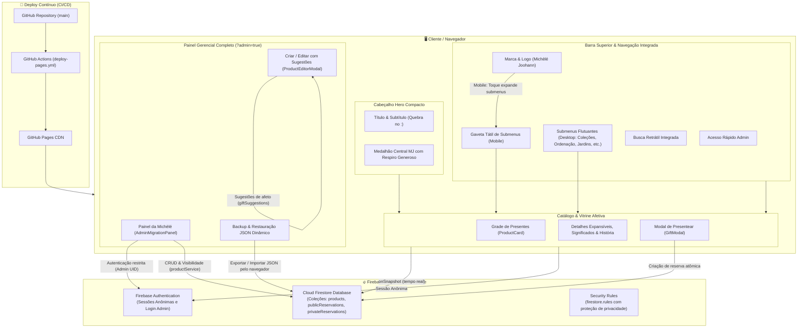

# 🌿 Jardim dos Presentes de Michèlé Joohann

> **Desejar. Cultivar. Conquistar. Florescer.** ✨  
> Um espaço digital e afetivo para transformar desejos em sementes: registrar sonhos, acompanhar o que já foi conquistado e dar significado a cada realização.
> 
> *Direção de Arte: Herbarium Botânico Vitoriano de Luxo com selo medalhão MJ, folhagens silvestres, heras e marcelas.*

---

## 🏛️ Arquitetura do Sistema

O **Jardim dos Presentes** é construído sobre uma arquitetura moderna e desacoplada com **React 19**, **Vite 7** e **Firebase 12**, entregue via **GitHub Pages** através de integração e deploy contínuos (GitHub Actions).

> [!IMPORTANT]
> **Base de Dados como Fonte Única da Verdade:**  
> Nenhum dado de produto é armazenado no código-fonte ou em arquivos estáticos no repositório. O catálogo completo é armazenado, consultado e gerenciado **exclusivamente no Cloud Firestore**, garantindo que a aplicação seja ultra leve, segura, dinâmica e sempre atualizada em tempo real.


```mermaid
graph TB
    subgraph Client ["🖥️ Cliente / Navegador"]
        subgraph TopNav ["Barra Superior & Navegação Integrada"]
            Brand["Marca & Logo (Michèlé Joohann)"]
            MobileSubmenus["Gaveta Tátil de Submenus (Mobile)"]
            DesktopSubmenus["Submenus Flutuantes (Desktop: Coleções, Ordenação, Jardins, etc.)"]
            SearchBtn["Busca Retrátil Integrada"]
            AdminBtn["Acesso Rápido Admin"]
        end

        subgraph HeroSection ["Cabeçalho Hero Compacto"]
            HeroTitle["Título & Subtítulo (Quebra no :)"]
            Medallion["Medalhão Central MJ com Respiro Generoso"]
        end

        subgraph PublicUI ["Catálogo & Vitrine Afetiva"]
            Grid["Grade de Presentes (ProductCard)"]
            Details["Detalhes Expansíveis, Significados & História"]
            GiftModalUI["Modal de Presentear (GiftModal)"]
        end

        subgraph AdminUI ["Painel Gerencial Completo (?admin=true)"]
            AdminPanel["Painel da Michèlé (AdminMigrationPanel)"]
            ProductEditor["Criar / Editar com Sugestões (ProductEditorModal)"]
            BackupTool["Backup & Restauração JSON Dinâmico"]
        end
    end

    subgraph FirebaseServices ["🔥 Firebase Backend-as-a-Service"]
        Auth["Firebase Authentication<br/>(Sessões Anônimas e Login Admin)"]
        Firestore["Cloud Firestore Database<br/>(Coleções: products, publicReservations, privateReservations)"]
        Rules["Security Rules<br/>(firestore.rules com proteção de privacidade)"]
    end

    subgraph HostingPipeline ["🚀 Deploy Contínuo (CI/CD)"]
        GHRepo["GitHub Repository (main)"]
        GHActions["GitHub Actions (deploy-pages.yml)"]
        GHPages["GitHub Pages CDN"]
    end

    Brand -- "Mobile: Toque expande submenus" --> MobileSubmenus
    DesktopSubmenus --> PublicUI
    MobileSubmenus --> PublicUI
    TopNav --> PublicUI
    HeroSection --> PublicUI

    PublicUI -- "onSnapshot (tempo real)" --> Firestore
    PublicUI -- "Sessão Anônima" --> Auth
    GiftModalUI -- "Criação de reserva atômica" --> Firestore

    AdminPanel -- "Autenticação restrita (Admin UID)" --> Auth
    AdminPanel -- "CRUD & Visibilidade (productService)" --> Firestore
    ProductEditor -- "Sugestões de afeto (giftSuggestions)" --> ProductEditor
    BackupTool -- "Exportar / Importar JSON pelo navegador" --> Firestore

    GHRepo --> GHActions
    GHActions --> GHPages
    GHPages --> Client
```

---

## 🎨 Identidade Visual & Design Responsivo

O projeto adota uma atmosfera de **herbário clássico do século XIX**, unindo sofisticação botânica, afeto e ergonomia móvel:

1. **Moldura Botânica Silvestre**: Ramos de marcela e folhagens botânicas nas laterais que emolduram suavemente a tela sem atrapalhar a leitura.
2. **Selo Medalhão MJ**: Emblema heráldico central gravado em ouro antigo (`#ad9363`) e verde bosque (`#162a1c`), envolvido por ramagens de hera. Possui espaçamento generoso e equilibrado (`18px` a `22px`), garantindo que não fique grudado no texto.
3. **Tipografia do Hero Balanceada**: A frase de curadoria é disposta em duas linhas harmônicas quebradas no dois-pontos (`:`), preservando o ritmo estético em qualquer resolução:
   - *Curadoria Exclusiva de Sonhos:*
   - *Onde a Magia do Presente se Revela.*
4. **Submenus Responsivos na Logo do Topo**:
   - No celular/mobile (`<= 768px`), os submenus ficam discretamente integrados à logo no canto superior esquerdo (com um indicador sutil `▾`/`▴`).
   - Ao tocar na logo, abre-se uma gaveta suspensa elegante no estilo *Herbarium Vitoriano* com acesso rápido a:
     - 🌿 **Coleções**
     - ⭐ **Ordenação & Prioridades**
     - 🌱 **Jardins**
     - 📖 **Sobre**
     - ✉️ **Contato**
   - No desktop, a navegação clássica flutuante permanece acessível no centro do cabeçalho.
5. **Cards Editoriais de Presente**:
   - Fotografia ou ícone botânico emoldurado.
   - Badge de status (*Disponível*, *Reservado*, *Floresceu 🌸*).
   - Seção poética *"O sonho"*.
   - Gaveta de detalhes colapsável: tags de significados, tamanho desejado, prioridade, decisão de compra, valores e histórias.
   - Botão **🎁 Presentear** com fluxo de anonimato e dedicatória.

---

## 🛠️ Painel Gerencial do Catálogo (`?admin=true`)

Acesso restrito à administradora com credenciais do Firebase Authentication:

### 1. Gestão Completa de Presentes (CRUD)
- **✨ + Novo Presente**: Criação de produtos diretamente no Firestore com geração de slug identificador único.
- **🪄 Sugestões Inteligentes de Afeto**: Ao digitar o nome ou selecionar a categoria do presente, o sistema sugere automaticamente:
  - Nível de prioridade sugerido (*Alta*, *Média*, *Baixa*) com justificativa afetiva.
  - Texto afetivo para *"O sonho"*.
  - Narrativa para *"A história"*.
  - Tags de significados simbólicos sugeridos.
- **✏️ Edição Dinâmica**: Atualização imediata de links de lojas, fotos, preços e dados afetivos.
- **👁️ Controle de Visibilidade**: Botão rápido para alternar entre **Habilitado** (visível no catálogo) e **Desabilitado** (oculto no site, mas preservado no banco).
- **🗑️ Exclusão Segura**: Remove o item do Firestore e limpa automaticamente eventuais registros de reserva vinculados.

### 2. Mensagens & Recados
- Leitura em tempo real das mensagens e dedicatórias deixadas pelos convidados.
- Visualização de contatos (e-mail, nome ou marcação de Amigo Secreto).
- Opção para liberar o presente de volta ao catálogo caso o convidado desista.

### 3. Backup & Restauração JSON
- **📥 Baixar Backup JSON**: Exporta todos os presentes cadastrados no Firestore diretamente para um arquivo `.json` no computador da administradora com 1 clique.
- **📤 Restaurar / Importar Arquivo JSON**: Permite carregar qualquer arquivo `.json` local para sincronizar produtos no Firestore via lote atômico (`writeBatch`), **sem que nenhum dado precise ficar salvo no código da aplicação**.

---

## 🔄 Ciclo de Vida dos Dados e Sincronização em Tempo Real

O **Cloud Firestore** é a **Fonte Única da Verdade** da aplicação:

1. **Coleção `products`**:
   - Armazena todos os desejos cadastrados (nome, categoria, subcategoria, preço, prioridade, imagem, história, sonho, visibilidade, etc.).
   - O listener reativo `onSnapshot` atualiza a vitrine instantaneamente sem necessidade de recarregar a página.
   - Itens com `enabled === false` permanecem no banco mas são omitidos da exibição pública.
2. **Coleção `publicReservations`**:
   - Guarda o status público de reserva (`reserved` ou `received`) associado a cada produto.
   - Permite que todos os visitantes vejam o estado dos presentes sem expor dados pessoais dos convidados.
3. **Coleção `privateReservations`**:
   - Guarda as dedicatórias, nomes, contatos e mensagens confidenciais enviadas pelos convidados.
   - Protegida por regras de segurança estritas no Firestore (`firestore.rules`), visível unicamente pela administradora autenticada.

---

## 🗂️ Estrutura do Projeto

```text
JardimDosPresentes/
├── .github/
│   └── workflows/
│       └── deploy-pages.yml          # CI/CD: build Vite e deploy automático no GitHub Pages
├── docs/
│   ├── ARCHITECTURE.md               # Detalhes de arquitetura e decisões técnicas completas
│   ├── FIREBASE_SETUP.md             # Instruções de configuração do Firebase Console
│   ├── INITIAL_MIGRATION.md          # Histórico da migração inicial
│   └── PRODUCT_BACKLOG.md            # Histórico de requisitos e melhorias
├── public/
│   ├── favicon.svg                   # Favicon oficial do Jardim
│   └── images/                       # Ilustrações botânicas vetoriais e logotipo MJ
├── src/
│   ├── components/
│   │   ├── AdminMigrationPanel.jsx   # Painel da Michèlé (CRUD, recados e ferramenta de backup)
│   │   ├── GiftModal.jsx             # Modal interativo de presente com dedicatória e anonimato
│   │   ├── ProductCard.jsx           # Card editorial de presente (status, tags, sonho e links)
│   │   └── ProductEditorModal.jsx    # Modal de criação/edição com motor de sugestões de afeto
│   ├── firebase/
│   │   └── config.js                 # Inicialização do Firebase (Auth, Firestore, Storage)
│   ├── services/
│   │   ├── giftSuggestions.js        # Motor de sugestões afetivas (prioridade, sonho, história)
│   │   ├── productService.js         # Persistência, edição, visibilidade e exclusão no Firestore
│   │   └── reservationService.js     # Serviços atômicos de reserva pública e privada
│   ├── styles/
│   │   └── global.css                # Design system completo do Herbário Vitoriano e responsividade
│   ├── App.jsx                       # Aplicação principal: topo, hero, busca retrátil, filtros e grid
│   └── main.jsx                      # Ponto de montagem React 19
├── firestore.rules                   # Regras de segurança atômicas e privacidade do Firestore
├── index.html                        # Entrada HTML com tipografia nobre e tags de SEO
├── package.json                      # Manifesto de dependências do projeto
├── vite.config.js                    # Configuração Vite com base URL e code-splitting por vendors
└── README.md                         # Documentação oficial do projeto
```

---

## 🛠️ Tecnologias

- **React 19** (`^19.1.0`)
- **Vite 7** (`^7.0.0`) com Code-Splitting configurado
- **Firebase 12** (`^12.0.0`): Authentication, Cloud Firestore e Cloud Storage
- **Vanilla CSS Moderno**: Design system artesanal com tokens e gradientes botânicos
- **Google Fonts**: *Cinzel*, *Cormorant Garamond* e *Plus Jakarta Sans*
- **GitHub Actions & GitHub Pages**: CI/CD automatizado a cada push na branch `main`

---

## 🚀 Como Executar Localmente

### 1. Clonar o repositório e instalar dependências
```bash
git clone https://github.com/michelejoohann/jardim-dos-presentes.git
cd JardimDosDesejos
npm install
```

### 2. Iniciar o servidor de desenvolvimento
```bash
npm run dev
```
O servidor iniciará em `http://localhost:5173/jardim-dos-presentes/`.

### 3. Gerar build de produção
```bash
npm run build
```

### 4. Pré-visualizar o pacote de produção
```bash
npm run preview
```

---

## 🌸 Filosofia

O **Jardim dos Presentes** não é uma simples lista de desejos. É um registro poético e afetuoso de aspirações, histórias e memórias — permitindo cultivar a gratidão e celebrar cada sonho que floresce.
