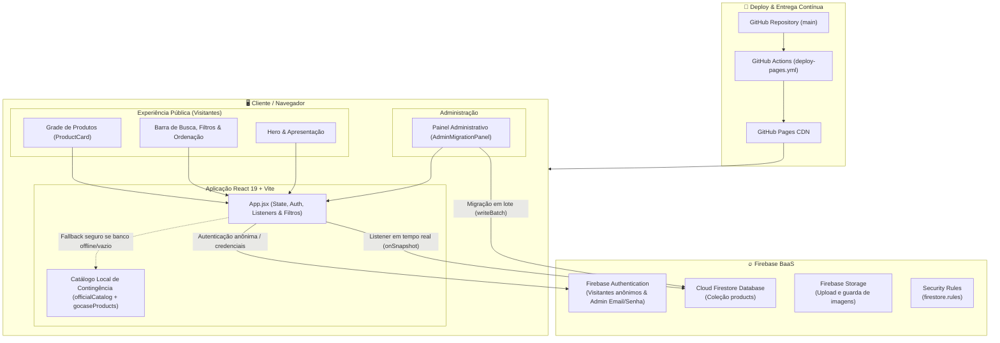
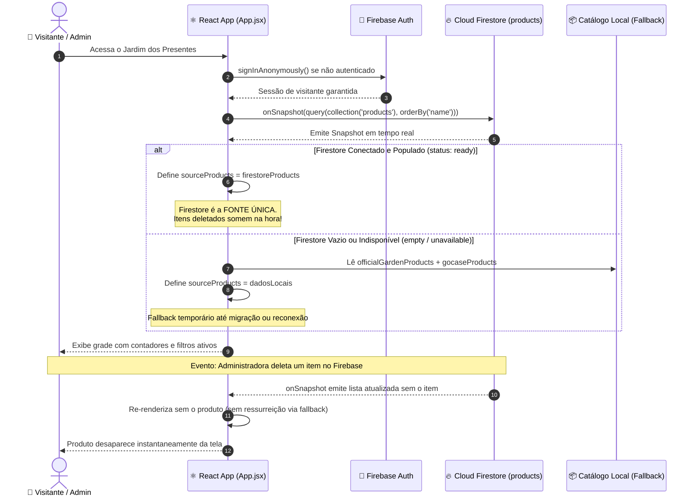

# Arquitetura — Jardim dos Presentes de Michèlé Joohann

## 1. Visão Geral do Sistema

O **Jardim dos Presentes** é uma aplicação web moderna, responsiva e afetiva que transforma uma lista de desejos em uma experiência visual rica. Construída sobre **React 19**, **Vite 7** e **Firebase 12**, a aplicação oferece consulta em tempo real aos desejos, filtros por ambientes e canteiros, busca textual e um painel de migração/administração integrado.

---

## 2. Diagrama Arquitetural Geral



---

## 3. Ciclo de Vida dos Dados e Sincronização em Tempo Real

A arquitetura adota o **Cloud Firestore como Fonte Única da Verdade** em tempo de execução. O catálogo local existe exclusivamente como contingência de inicialização ou indisponibilidade de rede.



---

## 4. Estrutura de Diretórios Atual

```text
JardimDosDesejos/
├── .github/
│   └── workflows/
│       └── deploy-pages.yml      # CI/CD: build e deploy automático no GitHub Pages
├── docs/
│   ├── ARCHITECTURE.md           # Desenho da arquitetura, decisões e fluxos
│   ├── FIREBASE_SETUP.md         # Guia de configuração do Firebase Console
│   ├── INITIAL_MIGRATION.md      # Procedimento de migração e consolidação de dados
│   └── PRODUCT_BACKLOG.md        # Histórico de requisitos e backlog
├── public/
│   ├── favicon.svg               # Ícone do site
│   └── images/                   # Imagens estáticas públicas
├── src/
│   ├── components/
│   │   ├── AdminMigrationPanel.jsx # Painel administrativo e migração (acesso sob demanda via ?admin=true)
│   │   └── ProductCard.jsx       # Card de produto com badge, história e sonho
│   ├── data/
│   │   ├── catalog.js            # Catálogo histórico base de produtos
│   │   ├── officialCatalog.js    # Catálogo oficial consolidado (84 produtos com overrides)
│   │   └── gocaseProducts.js     # Coleção específica Gocase (2 produtos)
│   ├── firebase/
│   │   └── config.js             # Inicialização do SDK do Firebase (Auth, DB, Storage)
│   ├── services/
│   │   └── productMigration.js   # Serviço de migração idempotente em lotes (writeBatch)
│   ├── styles/
│   │   └── global.css            # Folha de estilos global com design tokens e responsividade
│   ├── App.jsx                   # Componente raiz: estado, autenticação e reatividade
│   └── main.jsx                  # Ponto de entrada React 19
├── firestore.rules               # Regras de segurança do Cloud Firestore
├── index.html                    # Template HTML com meta tags SEO e viewport
├── package.json                  # Dependências (React 19, Vite 7, Firebase 12)
├── vite.config.js                # Configuração do Vite com base /jardim-dos-presentes/
└── README.md                     # Documentação central do projeto
```

---

## 5. Modelo de Dados (`products/{productId}`)

Cada documento na coleção `products` utiliza um ID estável e compreensível (slug kebab-case):

| Campo | Tipo | Descrição | Exemplo |
|---|---|---|---|
| `id` | `string` | Identificador estável do documento | `"camp-snap-cs-pro"` |
| `name` | `string` | Nome do produto | `"Camp Snap CS-Pro"` |
| `category` | `string` | Categoria principal (ambiente) | `"tecnologia"` |
| `subcategory` | `string` | Subcategoria (canteiro) | `"fotografia-memorias"` |
| `collection` | `string` | Coleção ou série temática | `"Memórias da Vida"` |
| `description` | `string` | Descrição técnica / poética | `"Câmera digital minimalista sem tela..."` |
| `dream` | `string` | O sonho ou intenção associada | `"Viver o momento antes de olhar a foto..."` |
| `story` | `string` | História de afeto do desejo | `"Registrar a vida como ela acontece..."` |
| `meanings` | `string[]` | Palavras-chave simbólicas | `["Memórias", "Presença", "Família"]` |
| `price` | `number \| null` | Valor numérico de referência | `299.00` |
| `priceLabel` | `string` | Formatação amigável do valor | `"R$ 299,00 no Pix"` |
| `url` | `string` | Link direto para a loja | `"https://..."` |
| `imageUrl` | `string` | URL da foto do produto | `"https://..."` |
| `quantityDesired` | `number` | Quantidade almejada | `1` |
| `quantityReceived` | `number` | Quantidade já recebida | `0` |
| `status` | `string` | Estado do desejo | `"available"`, `"reserved"`, `"received"` |
| `published` | `boolean` | Visibilidade do item | `true` ou `false` |
| `updatedAt` | `timestamp` | Timestamp de atualização | `ServerTimestamp` |

---

## 6. Segurança e Controle de Acesso

1. **Leitura Pública**: Qualquer visitante (anônimo ou não autenticado) possui permissão de leitura sobre a coleção `products`.
2. **Escrita Administrativa Restrita**: Apenas o usuário com o UID administrativo autenticado (`7G4v3hEMtaVzI8MUDsXjVCNXGJz1`) possui permissão para executar `create`, `update` ou `delete` na coleção `products`.
3. **Validação nas Regras**: Todas as permissões são reforçadas no servidor pelas regras declaradas em `firestore.rules`, impossibilitando qualquer manipulação indevida pelo navegador do cliente.
