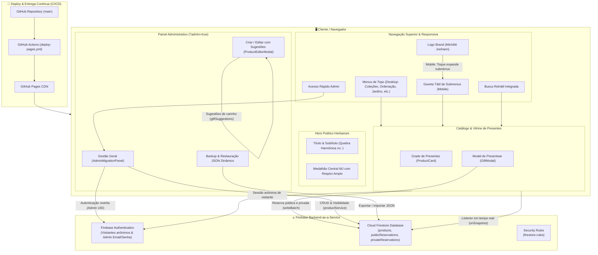
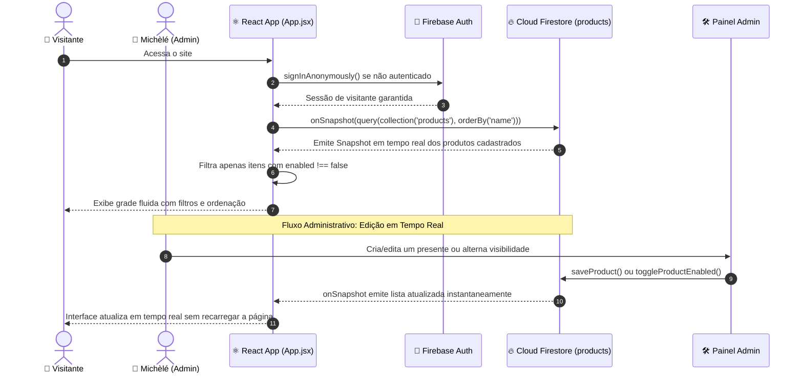

# 🏛️ Arquitetura do Sistema — Jardim dos Presentes de Michèlé Joohann

## 1. Visão Geral do Sistema

O **Jardim dos Presentes** é uma aplicação web moderna, responsiva e acolhedora que transforma uma lista de desejos em uma experiência visual rica inspirada em um *Herbarium Botânico Vitoriano*. Construída sobre **React 19**, **Vite 7** e **Firebase 12**, a aplicação oferece:

- **100% Cloud Firestore como Fonte Única da Verdade**: Nenhum dado de produto é armazenado no código-fonte ou em arquivos estáticos da aplicação. Todo o catálogo reside e é atualizado dinamicamente no banco de dados.
- **Painel Gerencial Completo**: Interface administrativa com autenticação segura, permitindo criação de novos presentes, edição, exclusão, controle de visibilidade (habilitado/desabilitado) e sugestões inteligentes de textos acolhedores, prioridades, sonhos e histórias.
- **Backup & Restauração Sob Demanda**: Ferramenta de exportação e importação de backups em formato JSON diretamente pelo navegador, mantendo o repositório 100% limpo e desacoplado dos dados.
- **Experiência Responsiva e Acessível**: Gaveta suspensa tátil de submenus oculta sob a logo superior esquerda no mobile, tipografia equilibrada com quebras harmônicas e espaçamento generoso do medalhão central.
- **Code-Splitting e Otimização**: Chunks otimizados no Vite com vendor splitting (`vendor-react`, `vendor-firebase`) e carregamento sob demanda (`lazy` + `Suspense`).

---

## 2. Diagrama Arquitetural Geral


```mermaid
graph TB
    subgraph Client ["🖥️ Cliente / Navegador"]
        subgraph TopNav ["Navegação Superior & Responsiva"]
            Brand["Logo Brand (Michèlé Joohann)"]
            MobileDrawer["Gaveta Tátil de Submenus (Mobile)"]
            DesktopNav["Menus de Topo (Desktop: Coleções, Ordenação, Jardins, etc.)"]
            SearchBtn["Busca Retrátil Integrada"]
            AdminBtn["Acesso Rápido Admin"]
        end

        subgraph HeroSection ["Hero Poético Herbarium"]
            HeroTitle["Título & Subtítulo (Quebra Harmônica no :)"]
            Medallion["Medalhão Central MJ com Respiro Amplo"]
        end

        subgraph PublicUI ["Catálogo & Vitrine de Presentes"]
            Grid["Grade de Presentes (ProductCard)"]
            GiftModalUI["Modal de Presentear (GiftModal)"]
        end

        subgraph AdminUI ["Painel Administrativo (?admin=true)"]
            AdminPanel["Gestão Geral (AdminMigrationPanel)"]
            ProductEditor["Criar / Editar com Sugestões (ProductEditorModal)"]
            BackupTool["Backup & Restauração JSON Dinâmico"]
        end
    end

    subgraph FirebaseServices ["🔥 Firebase Backend-as-a-Service"]
        Auth["Firebase Authentication<br/>(Visitantes anônimos & Admin Email/Senha)"]
        Firestore["Cloud Firestore Database<br/>(products, publicReservations, privateReservations)"]
        Rules["Security Rules<br/>(firestore.rules)"]
    end

    subgraph HostingPipeline ["🚀 Deploy & Entrega Contínua (CI/CD)"]
        GHRepo["GitHub Repository (main)"]
        GHActions["GitHub Actions (deploy-pages.yml)"]
        GHPages["GitHub Pages CDN"]
    end

    Brand -- "Mobile: Toque expande submenus" --> MobileDrawer
    DesktopNav --> PublicUI
    MobileDrawer --> PublicUI
    SearchBtn --> PublicUI
    AdminBtn --> AdminPanel

    PublicUI -- "Listener em tempo real (onSnapshot)" --> Firestore
    PublicUI -- "Sessão anônima de visitante" --> Auth
    GiftModalUI -- "Reserva pública e privada (writeBatch)" --> Firestore

    AdminPanel -- "Autenticação restrita (Admin UID)" --> Auth
    AdminPanel -- "CRUD & Visibilidade (productService)" --> Firestore
    ProductEditor -- "Sugestões de carinho (giftSuggestions)" --> ProductEditor
    BackupTool -- "Exportar / Importar JSON" --> Firestore

    GHRepo --> GHActions
    GHActions --> GHPages
    GHPages --> Client
```

---

## 3. Ciclo de Vida dos Dados e Sincronização em Tempo Real

A arquitetura adota o **Cloud Firestore como Fonte Única e Exclusiva da Verdade**:


```mermaid
sequenceDiagram
    autonumber
    actor Visitante as 👤 Visitante
    actor Admin as 🌿 Michèlé (Admin)
    participant App as ⚛️ React App (App.jsx)
    participant Auth as 🔐 Firebase Auth
    participant Firestore as 🔥 Cloud Firestore (products)
    participant AdminPanel as 🛠️ Painel Admin

    Visitante->>App: Acessa o site
    App->>Auth: signInAnonymously() se não autenticado
    Auth-->>App: Sessão de visitante garantida

    App->>Firestore: onSnapshot(query(collection('products'), orderBy('name')))
    Firestore-->>App: Emite Snapshot em tempo real dos produtos cadastrados

    App->>App: Filtra apenas itens com enabled !== false
    App-->>Visitante: Exibe grade fluida com filtros e ordenação

    Note over Admin,Firestore: Fluxo Administrativo: Edição em Tempo Real
    Admin->>AdminPanel: Cria/edita um presente ou alterna visibilidade
    AdminPanel->>Firestore: saveProduct() ou toggleProductEnabled()
    Firestore-->>App: onSnapshot emite lista atualizada instantaneamente
    App-->>Visitante: Interface atualiza em tempo real sem recarregar a página
```

---

## 4. Estrutura de Diretórios Atual

```text
JardimDosPresentes/
├── .github/
│   └── workflows/
│       └── deploy-pages.yml          # CI/CD: build e deploy automático no GitHub Pages
├── docs/
│   ├── ARCHITECTURE.md               # Este documento de arquitetura e decisões técnicas
│   ├── FIREBASE_SETUP.md             # Guia de configuração do Firebase Console
│   ├── INITIAL_MIGRATION.md          # Histórico da migração inicial
│   └── PRODUCT_BACKLOG.md            # Histórico de requisitos e melhorias
├── public/
│   ├── favicon.svg                   # Ícone oficial do site
│   └── images/                       # Ilustrações botânicas vetoriais e logotipo MJ
├── src/
│   ├── components/
│   │   ├── AdminMigrationPanel.jsx   # Painel de gestão da Michèlé (CRUD, recados e backup)
│   │   ├── GiftModal.jsx             # Modal interativo de presente com dedicatória
│   │   ├── ProductCard.jsx           # Card editorial de presente (status, tags, sonho e links)
│   │   └── ProductEditorModal.jsx    # Modal de criação/edição com motor de sugestões
│   ├── firebase/
│   │   └── config.js                 # Inicialização do Firebase (Auth, Firestore, Storage)
│   ├── services/
│   │   ├── giftSuggestions.js        # Motor de sugestões contextuais (histórias, prioridades, sonhos)
│   │   ├── productService.js         # Serviço de persistência, alternância e exclusão no Firestore
│   │   └── reservationService.js     # Serviço de reservas públicas e privadas no Firestore
│   ├── styles/
│   │   └── global.css                # Folha de estilos Herbarium Vitoriano e responsividade
│   ├── App.jsx                       # Componente raiz: topo, busca, hero, filtros reativos e catálogo
│   └── main.jsx                      # Ponto de entrada React 19
├── firestore.rules                   # Regras de segurança do Cloud Firestore
├── index.html                        # Template HTML com meta tags SEO e viewport
├── package.json                      # Dependências do projeto (React 19, Vite 7, Firebase 12)
├── vite.config.js                    # Configuração Vite com base URL e code-splitting
└── README.md                         # Documentação central do projeto
```

---

## 5. Dicionário de Dados (`products/{productId}`)

Cada documento na coleção `products` do Cloud Firestore possui a seguinte estrutura oficial:

| Campo | Tipo | Descrição | Exemplo |
|---|---|---|---|
| `id` | `string` | Identificador único e legível (slug) | `"asas-de-fada-luxo-01"` |
| `name` | `string` | Nome carinhoso e comercial do produto | `"Asas de Fada / Borboleta em Tecido"` |
| `category` | `string` | Categoria principal (Coleção) | `"moda"`, `"casa"`, `"arte"`, `"joias"` |
| `subcategory` | `string` | Canteiro / Subcategoria | `"acessorios"`, `"fantasia"`, `"decoracao"` |
| `collection` | `string` | Coleção temática do Jardim | `"Magia das Fadas"`, `"Herbarium"` |
| `price` | `number \| null` | Valor numérico de referência | `89.90` |
| `priceLabel` | `string` | Formatação em moeda amigável | `"R$ 89,90"`, `"Consultar na loja"` |
| `priority` | `string` | Nível de prioridade / importância | `"alta"`, `"media"`, `"baixa"` |
| `enabled` | `boolean` | Flag de visibilidade ativa no site | `true` (visível) ou `false` (oculto) |
| `published` | `boolean` | Espelhamento de visibilidade para compatibilidade | `true` ou `false` |
| `visible` | `boolean` | Espelhamento de visibilidade para compatibilidade | `true` ou `false` |
| `imageUrl` | `string` | URL direta da fotografia principal | `"https://..."` |
| `url` | `string` | Link direto para a loja onde comprar | `"https://..."` |
| `store` | `string` | Nome da loja fornecedora | `"SHEIN"`, `"Amazon"`, `"Ateliê"` |
| `description` | `string` | Descrição técnica ou estética do item | `"Asas artesanais em organza furta-cor..."` |
| `dream` | `string` | O sonho ou intenção associada ao presente | `"Incorporar o espírito das fadas e a leveza..."` |
| `story` | `string` | História de carinho ou memória conectada | `"Desde a infância o fascínio por asas e seres mágicos..."` |
| `meanings` | `string[]` | Tags simbólicas de significado | `["Liberdade", "Magia", "Sonho"]` |
| `sizes` | `string[]` | Tamanhos ou especificações | `["Único", "Ajustável"]` |
| `notes` | `string[]` | Observações adicionais | `["Preferência por tons translúcidos"]` |
| `quantityDesired` | `number` | Quantidade almejada | `1` |
| `quantityReceived` | `number` | Quantidade já conquistada / florescida | `0` |
| `status` | `string` | Estado calculado ou atribuído | `"available"`, `"reserved"`, `"received"` |
| `createdAt` | `timestamp` | Data de criação no Firestore | `ServerTimestamp` |
| `updatedAt` | `timestamp` | Data da última alteração no Firestore | `ServerTimestamp` |

---

## 6. Segurança e Regras de Controle de Acesso

As regras declaradas em `firestore.rules` asseguram:

1. **Leitura Pública**: Qualquer visitante (anônimo ou autenticado) pode consultar a coleção `products` e a coleção `publicReservations`.
2. **Escrita Administrativa Exclusiva**: Apenas a conta autenticada correspondente ao `ADMIN_UID` (`7G4v3hEMtaVzI8MUDsXjVCNXGJz1`) possui permissão para executar `create`, `update` ou `delete` na coleção `products`.
3. **Privacidade das Dedicatórias**: A coleção `privateReservations` (que guarda nomes, e-mails e mensagens confidenciais dos convidados) pode ser criada por qualquer visitante no momento do presente, mas **somente a administradora autenticada pode ler e listar** as mensagens.
4. **Isolamento de Código**: Nenhum dado confidencial ou lista de produtos estática trafega no repositório. O banco de dados é a autoridade máxima e única.
